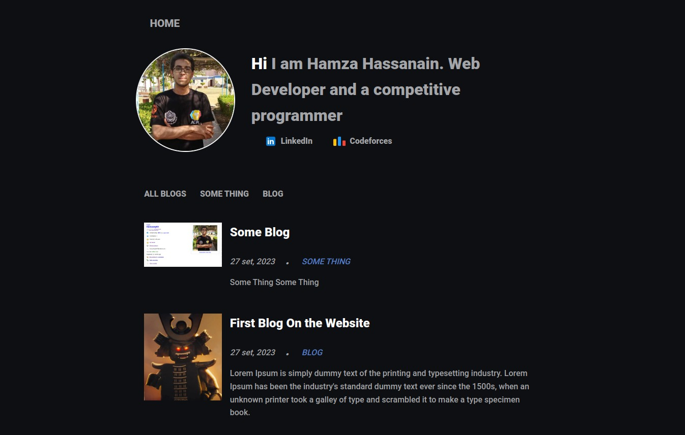
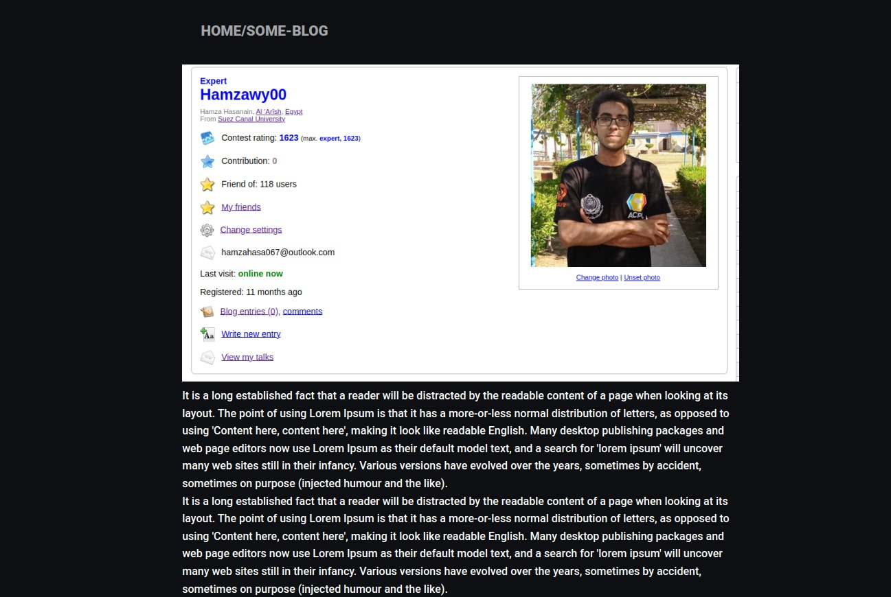

# The Front-end the personal-blog

### [Se the back end](https://github.com/Hamzawy00/personal-blog-backend)

This application is created with <strong> React </strong>

## How to get Started with the application:

First in your terminal

```
git clone https://github.com/Hamzawy00/personal-blog-frontend.git

cd personal-blog-frontend

npm i
```

Then create a <strong> .env </strong> and past the follwing:

```
REACT_APP_BASE_URL=https://url-to-the-backend/api/v1

```

After this make sure you are in the directory of the application and in the termnial run:

```
npm start
```

### How the website looks like:




